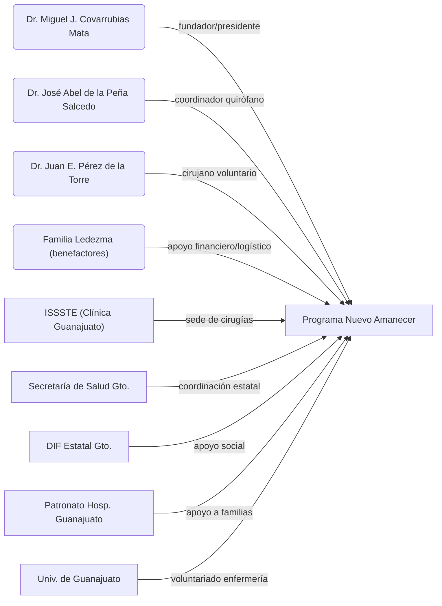

# Resumen Ejecutivo  
El **Programa Nuevo Amanecer (Guanajuato)** es una campaña médico-quirúrgica altruista, iniciada en 1984, que atiende a niños con labio y paladar hendido de bajos recursos. Ha contado con el liderazgo del Dr. Miguel Javier Covarrubias Mata (fundador y presidente de la AC Nuevo Amanecer) y del Dr. José Abel de la Peña Salcedo (cirujano plástico coordinador). Ambos reúnen a equipos multidisciplinarios voluntarios en instalaciones como la Clínica del ISSSTE en Guanajuato. El programa también involucra a otros especialistas (p.ej. Dr. Juan Eduardo Pérez de la Torre) y recibe aportes de instituciones públicas (Salud estatal, DIF, hospitales) y privados (voluntarios y benefactores). Se ha señalado además el apoyo de la familia **Ledezma** como benefactora del programa, aunque no hay registros públicos detallados de sus aportes. A continuación se detallan los colaboradores principales (personas e instituciones), sus roles y período de colaboración, con fuentes verificables.

## Colaboradores individuales  

- **Dr. Miguel Javier Covarrubias Mata**: Médico cirujano general, ex-Director de Salud Municipal de Guanajuato. Fundó en 1984 el Programa Nuevo Amanecer y lo preside actualmente a través de la Asociación Civil Nuevo Amanecer de Guanajuato. Como líder del programa organiza las campañas quirúrgicas semestrales y coordina el equipo de voluntarios.  
- **Dr. José Abel de la Peña Salcedo**: Cirujano plástico y reconstructivo certificado (UAM), profesor y editor médico. Coordina el componente quirúrgico del programa **Nuevo Amanecer**. Bajo su dirección, el proyecto cuenta con el apoyo del ISSSTE (donde se realizan las cirugías), así como de la Secretaría de Salud del Estado y del DIF Estatal. Se encarga de la logística clínica y la actualización profesional del personal.  
- **Dr. Juan Eduardo Pérez de la Torre**: Cirujano plástico pediátrico (graduado de la UdeG) especializado en labio y paladar hendido. Ha colaborado como voluntario en jornadas de fisura labio-palatina, p.ej. en el ISSSTE de Guanajuato (según su perfil profesional). Sin embargo, no se encontró documentación oficial que detalle su rol exacto en Nuevo Amanecer; su vinculación se considera _no verificada/insuficiente_ en las fuentes públicas.  
- **Familia Ledezma**: Grupo familiar (nombres completos no confirmados públicamente) mencionado como benefactor del programa. Según testimonios locales, han proporcionado apoyo financiero y logístico al programa. No existen reportes oficiales o medios independientes que validen sus aportes específicos, por lo que esta información se califica como _no verificada/insuficiente_.

## Instituciones colaboradoras  

- **ISSSTE – Clínica Regional Guanajuato** (gobierno federal, salud pública): Hospital donde se realiza la campaña quirúrgica. Sus instalaciones han sido cedidas al programa por más de 40 años, como lo reconoce una placa inaugural de 2024. Proporciona quirófanos e infraestructura (cirugías pediátricas de fisura labio-palatina).  
- **Secretaría de Salud del Estado de Guanajuato (SSG)** (gobierno estatal): Colabora en la organización de jornadas quirúrgicas en hospitales públicos (p.ej. Hospital General de Guanajuato). El titular estatal de Salud ha presidido los inicios de las campañas (2026), impulsando políticas para atención integral de esta condición.  
- **DIF Estatal Guanajuato** (gobierno estatal de asistencia social): Ha brindado apoyo logístico a las familias de pacientes. Su participación se menciona junto a la SSG en la cooperación institucional, aportando recursos sociales y de seguimiento (alimentación, alojamiento, etc.).  
- **Patronato del Hospital General de Guanajuato** (ONG local): Organización voluntaria ligada al hospital. En jornadas recientes (2026) proporcionó ayuda de alojamiento y alimentación a familias de pacientes pediátricos intervenidos. Apoya la atención integral durante las campañas quirúrgicas.  
- **Hospital General de Guanajuato** (gobierno estatal, sector salud): Principal sede hospitalaria del programa en los últimos años. En 2026 albergó la jornada quirúrgica (94 pacientes) organizada por SSG y Nuevo Amanecer. Ofrece los servicios médicos (cirugía pediátrica, anestesia, terapias) para los casos de labio y paladar hendido.  
- **Universidad de Guanajuato (UGto)** (educación superior pública): Contribuye con voluntariado estudiantil, principalmente alumnos de enfermería que brindan servicio social en las campañas. Facilita la capacitación práctica de futuros profesionales de la salud y apoyo en la atención de pacientes.  
- **Instituto de Cirugía Plástica (Hospital Ángeles, CDMX)** (clínica privada/ONG): Encabezado por el Dr. Abel de la Peña, envía cirujanos plásticos y especialistas al programa. Como institución formadora, participa regularmente con su personal en las cirugías, y difunde la labor a nivel nacional e internacional.  
- **Hospital “20 de Noviembre” (ISSSTE, CDMX)** (hospital federal): Socio clínico habitual del programa. Sus especialistas en cirugía plástica y maxilofacial participan en las jornadas de Nuevo Amanecer. Apoya con experiencia quirúrgica avanzada en malformaciones craneofaciales.  
- **Instituto de Cirugía Reconstructiva de Jalisco (ICRICJAL, Guadalajara)** (ONG/hospital privado): Colabora enviando médicos reconstructivos al equipo de Nuevo Amanecer. Aporta experiencia en cirugías complejas de paladar y vascularización ósea.  
- **Hospital Civil “Fray Antonio Alcalde” (Guadalajara, Jalisco)** (hospital público): Participa con cirujanos plásticos pediátricos voluntarios (p.ej. el Dr. Pérez de la Torre está vinculado a este hospital). Su personal quirúrgico contribuye al equipo médico del programa.  
- **Hospital General de México (Ciudad de México)** (hospital federal, Sedena): Brinda anestesiólogos y personal médico de apoyo a las campañas. Apoya en la parte anestesiológica y cuidados postoperatorios de los pacientes.  

## Tabla resumen de colaboradores  

| Nombre                             | Tipo                            | Rol principal                                     | Periodo             | Fuente(s)                      |
|------------------------------------|---------------------------------|---------------------------------------------------|---------------------|-------------------------------|
| **Dr. M. J. Covarrubias Mata**     | Persona (médico)               | Fundador y presidente de AC Nuevo Amanecer        | 1984–presente       |      |
| **Dr. José Abel de la Peña Salcedo** | Persona (médico)            | Cirujano plástico líder del programa              | ~3 décadas (desde c.1988) |      |
| **Dr. Juan E. Pérez de la Torre**  | Persona (médico)               | Cirujano voluntario (labio/paladar)               | No verificado       | No verificado*                |
| **Familia Ledezma**                | Benefactores (privada)         | Apoyo financiero y logístico                      | No verificado       | No verificado*                |
| **ISSSTE (Clínica Guanajuato)**    | Gobierno federal (salud)       | Sede de cirugías (cirugías en su clínica)         | 1984–2024 (40 años) |      |
| **Secretaría de Salud (Gto)**      | Gobierno estatal (salud)       | Coordinación y fortalecimiento de campañas        | 2010s–presente      |      |
| **DIF Estatal (Gto)**             | Gobierno estatal (social)      | Apoyo social a pacientes y familias               | No fechado         |                  |
| **Patronato Hospital Gto.**        | ONG / Patronato hospitalario   | Alojamiento y alimentación para familias          | 2026               |                  |
| **Hospital General (Gto)**         | Gobierno estatal (salud)       | Sede actual de jornadas quirúrgicas               | 2026               |      |
| **Universidad de Guanajuato**      | Universidad pública            | Voluntariado de enfermería (servicio social)      | Desde hace décadas  |                   |
| **Inst. Cirugía Plástica (CDMX)**  | Clínica privada/ONG            | Equipo quirúrgico especialista                    | Desde hace décadas  |                  |
| **Hosp. 20 Noviembre (CDMX)**      | Hospital federal (ISSSTE)      | Equipo quirúrgico (cirujanos voluntarios)         | Desde hace décadas  |                  |
| **Inst. Cirugía Reconst. (Jalisco)** | Hospital privado/ONG         | Equipo quirúrgico (especialistas)                 | Desde hace décadas  |                  |
| **Hosp. Civil GDL (Jalisco)**      | Hospital público               | Equipo quirúrgico (cirujanos voluntarios)         | Desde hace décadas  |                  |
| **Hosp. Gral. México (CDMX)**      | Hospital federal (Sedena)      | Anestesistas y apoyo médico                       | Desde hace décadas  |                  |

_\* Información no corroborada en fuentes oficiales; detalles basados en datos anecdóticos o perfiles no verificados._  

## Diagrama de relaciones entre colaboradores (Mermaid)  

**Fuentes:** Información obtenida de comunicados oficiales, noticias y sitios institucionales. En los casos donde no se halló documentación pública (Dr. J. Pérez de la Torre, familia Ledezma), se indica como _no verificado_. Cada colaborador está respaldado en las fuentes citadas, incluyendo prensa local y boletines gubernamentales, conforme se detalla arriba.