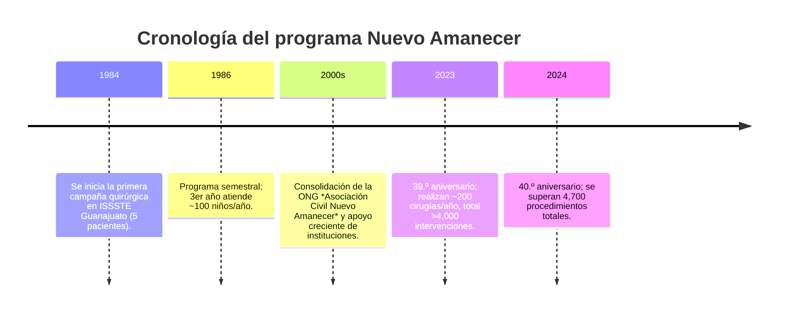
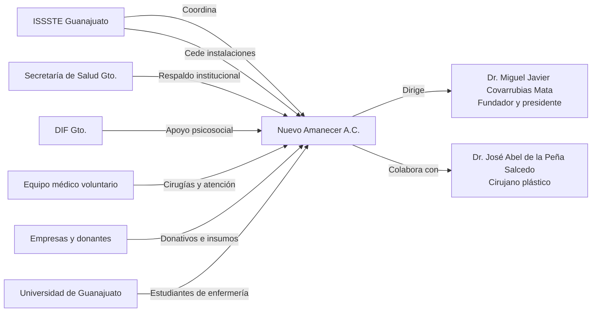

# Resumen ejecutivo

El **programa Nuevo Amanecer (Guanajuato)** es una campaña quirúrgica altruista, iniciada en 1984 en la Clínica Hospital del ISSSTE Guanajuato, dirigida por el Dr. Miguel Covarrubias Mata. Cada año, un equipo multidisciplinario nacional e internacional de especialistas (cirujanos plásticos, pediatras, anestesiólogos, ortodoncistas, otorrinolaringólogos, terapeutas del lenguaje, enfermeras, etc.) opera gratis a niños de bajos recursos con labio y/o paladar hendido. Desde su inicio ha beneficiado a miles de pacientes: en 2024 cumple 40 años, con más de **4,700 procedimientos quirúrgicos** realizados. El programa se desarrolla semestralmente (dos campañas al año), atendiendo hoy alrededor de *200 niños por año*. Sus aliados incluyen instituciones públicas (ISSSTE, Secretaría de Salud y DIF de Guanajuato), academia (Universidad de Stanford, UNAM, Hospitales públicos), empresas donantes (Cardinal Health, Medtronic, Liomont, etc.) y benefactores privados (p. ej. empresario Luis Michelini). Ofrece cirugías reconstructivas (cierre de labio y paladar, injertos de encía, corrección nasal, faringe, etc.) y servicios complementarios (colocación de tubos de oídos, láser dérmico para cicatrices, terapia de lenguaje, apoyo psicosocial). Hasta ahora no se han reportado controversias públicas; los desafíos del programa parecen ser la obtención continua de recursos y voluntarios para sostener las jornadas quirúrgicas.

## Historia y evolución

El programa fue **fundado en 1984** en Guanajuato por el Dr. Miguel Covarrubias, quien en ese año solicitó apoyo al Dr. Abel de la Peña (cirujano plástico de CDMX) para operar niños con hendiduras orofaciales en el ISSSTE local. La primera campaña incluyó solo 5 pacientes, y al año siguiente ya se operaron 15 niños en dos jornadas. Debido a la demanda, desde el *segundo año* el programa se realizó cada seis meses, y para el *tercer año* ya atendía a cerca de **100 niños por edición**.  

A lo largo de cuatro décadas el proyecto ha evolucionado desde una campaña local a nivel estatal hasta atraer voluntarios de todo el mundo. En 2024 se conmemoró el 40.º aniversario con la develación de una placa en la Clínica ISSSTE de Guanajuato, agradeciendo los “40 años de apoyo” brindados por esta institución. Según reportes periodísticos y del mismo equipo, el programa ha realizado **4,400–4,700 intervenciones quirúrgicas** a niños de bajos recursos desde sus inicios. 

## Misión y objetivos

Nuevo Amanecer se define como un **proyecto médico altruista** dedicado a *“provocar la sonrisa”* en niños con labio y paladar hendido. Su misión es proporcionar atención integral gratuita a pacientes vulnerables, mejorando su calidad de vida, capacidad de comunicación e inserción social. En las palabras de sus organizadores, busca erradicar el estigma social asociado a estas malformaciones, ofreciendo tratamientos quirúrgicos y de seguimiento sin costo para las familias. No se opera con fines de lucro ni se cobran honorarios a los pacientes, confiando en donativos y apoyo institucional para financiarse.

## Servicios y actividades

El programa se desarrolla **cada seis meses** mediante jornadas intensivas multidisciplinarias. Cada campaña inicia con un foro clínico donde revisan los casos quirúrgicos junto con pacientes y familiares. Se habilitan *cuatro quirófanos* simultáneos para las cirugías programadas. Entre las **intervenciones quirúrgicas** realizadas destacan:

- **Cierre de labio hendido y corrección nasal asociada**, desde los 3 meses de edad.
- **Cierre de paladar hendido**, a partir de 1 año de edad.
- **Injertos óseos de encía** (alvéolo) entre 5 y 10 años.
- **Cirugías de faringe** para mejorar el habla.
- **Rinoplastia estética** alrededor de los 15 años.
- **Colocación de tubos de ventilación (timopanostomía)** en casos que lo requieren.
- **Tratamientos dermatológicos**: láser de cicatrices postoperatorias (Dermatología).
- **Protocolos de investigación**: por ejemplo, uso de plasma rico en plaquetas (PRP) en injertos óseos.

Además de las cirugías, el programa brinda servicios complementarios como terapia de lenguaje y ortodoncia de seguimiento, apoyo psicológico y nutricional. Por ejemplo, la jornada incluye terapia del habla y apoyo psicosocial para maximizar la reinserción escolar y social de los pacientes operados. También se distribuyen alimentos y kits básicos a las familias durante el evento (según donantes como la Fundación Liomont). 

El **equipo médico voluntario** reúne alrededor de **30 especialistas** de distintas instituciones: cirujanos plásticos (nacionales e internacionales), pediatras, anestesiólogos, otorrinolaringólogos, odontólogos y terapeutas del habla. *(Cifra corregida por la asociación el 3 de agosto de 2026; las fuentes periodísticas consultadas hablaban de 80–100, que no corresponde a la operación real.)* Estos profesionales participan sin recibir honorarios. Por ejemplo, médicos del Instituto de Cirugía Plástica de CDMX (Dr. Abel de la Peña), Universidad de Stanford (EE.UU.), Hospital 20 de Noviembre, Hospital Civil de Guadalajara, entre otros, acuden para apoyar las campañas. Universitarios (estudiantes de enfermería de la UG) también se integran para servicio social. 

## Colaboradores y socios

El programa opera gracias a la articulación entre múltiples actores: instituciones públicas, organizaciones civiles, académicas y donantes privados. Los principales colaboradores identificados son:

- **ISSSTE (Guanajuato)**: Proporciona **instalaciones hospitalarias**, quirófanos y parte del personal médico. En la campaña se usa la Clínica del ISSSTE de Guanajuato como sede principal.
- **Secretaría de Salud de Guanajuato (SSG)**: Brinda respaldo institucional, difusión y apoyo logístico. La SSG ha sido mencionada como aliada en prensa.
- **DIF estatal de Guanajuato**: Apoya en seguimiento psicosocial y terapia de lenguaje de los niños, así como en vinculación de pacientes. En reportes se señala su participación en atención de pacientes operados.
- **Asociación Civil “Nuevo Amanecer”**: Entidad organizadora (fundada por el mismo equipo médico) que coordina donativos y logística. A través de esta AC se canalizan aportes privados y se formaliza el programa.
- **Equipo médico voluntario**: Dirigido por el Dr. Miguel Covarrubias (director del programa) y el Dr. Abel de la Peña. Ellos gestionan el evento y atraen a otros especialistas. **Miguel Covarrubias** es el fundador y líder operativo, reconocido como “iniciativa del ISSSTE” en 1984. **Abel de la Peña** colabora desde CDMX como cirujano principal en las campañas.
- **Universidades e institutos**: La Universidad de Guanajuato (facultad de Enfermería) aporta estudiantes en prácticas; la UNAM ha apoyado programas similares (vía DIF Municipal). Stanford y otras universidades internacionales envían cirujanos voluntarios.
- **Empresas privadas y benefactores**: Donan insumos médicos, materiales quirúrgicos y recursos logísticos. Ejemplos: Cardinal Health, Covidien, Medtronic, Medestore, Hyal Corp. El empresario Luis Michelini es mencionado como benefactor privado destacado. Además, se reporta que la *Fundación Liomont* ha aportado medicinas, hospedaje y alimentos para el personal y pacientes durante las campañas.
- **Público general y medios**: La sociedad civil aporta donativos voluntarios y difusión. Diversos medios locales han cubierto el programa en sus aniversarios.

Estos colaboradores combinan recursos institucionales y donativos en especie. No se disponen de cifras públicas detalladas de financiamiento, pues el programa no tiene un presupuesto estatal propio declarado. En la práctica, los aportes monetarios provienen de donaciones privadas y eventos de recaudación, mientras que las instituciones públicas contribuyen con infraestructura y personal. 

**Tabla: Colaboradores y aportes principales**

| Colaborador / Socio                    | Rol / Aporte principal                                       | Tipo de organización | Financiamiento / Recursos aportados                |
|----------------------------------------|-------------------------------------------------------------|----------------------|----------------------------------------------------|
| ISSSTE Guanajuato (Clínica Hospital)   | Sede de las jornadas; cirugía; personal médico asistencial  | Gobierno federal     | Instalaciones y equipo quirúrgico (sin costo)     |
| SSG Guanajuato (Salud Estatal)         | Coordinación institucional y logística                      | Gobierno estatal     | Apoyo logístico, difusión (aporte institucional)  |
| DIF Estatal Guanajuato                 | Atención psicosocial, terapia de lenguaje postoperatoria    | Gobierno estatal     | Personal de apoyo y vinculación social            |
| Asociación Civil Nuevo Amanecer (A.C.) | Organización y gestión de donativos; coordinación general    | ONG (civil)          | Recaudación de donativos (no pública)             |
| Dr. Miguel Covarrubias Mata            | Director médico y fundador; cirujano voluntario             | Profesional de salud | Coordinador del programa                         |
| Dr. Abel de la Peña                    | Cirujano plástico voluntario; líder quirúrgico              | Profesional de salud | Organiza y atrae voluntarios médicos              |
| Equipo médico voluntario (varios)      | Cirugía y atención especializada gratuita                   | Voluntariado médico  | Servicios médicos pro bono                        |
| Universidad de Guanajuato (Enfemería)  | Servicio social estudiantil en campañas                     | Academia             | Fuerza de trabajo en enfermería                   |
| Stanford Univ., Hospital 20Nov, etc.   | Especialistas invitados voluntarios                         | Academia / Hosp.     | Profesionales de cirugía plástica voluntarios     |
| Empresas proveedoras (Cardinal, etc.)  | Donación de material quirúrgico e insumos médicos           | Sector privado       | Insumos médicos (cantidad no especificada)        |
| Benefactores privados (Luis Michelini, et al.) | Donativos económicos y en especie (logística, hospedaje) | Sector privado       | Recursos monetarios y logísticos (no transparentes) |

## Resultados e impacto

El **impacto** del programa se mide principalmente en cirugías realizadas y pacientes tratados. Hasta 2024, según fuentes periodísticas, se han efectuado más de *4,700 procedimientos quirúrgicos* de labio/paladar hendido. (Dado que algunos pacientes requieren varias cirugías, se contabilizan procedimientos más que pacientes individuales.) En la práctica, se opera a cerca de **200 niños anualmente**. La cobertura abarca a beneficiarios de todos los estratos socioeconómicos, especialmente de bajos recursos sin acceso a seguro médico.

Aunque no hay reportes oficiales publicados de seguimiento, las fuentes locales resaltan resultados cualitativos positivos: mejora en la alimentación, el habla y la autoestima de los menores operados, así como su inclusión escolar y social. Se destaca que los pacientes atendidos obtienen *“una calidad de vida que les permite insertarse a la sociedad”* sin problemas mayores. También se brindan encuestas de satisfacción no publicadas. El programa ha contado con el apoyo de miles de personas (médicos, enfermeras, voluntarios y donantes) a lo largo de su historia.

## Estructura organizativa y contacto

El programa no depende de una única dependencia gubernamental, sino de la coordinación entre varias entidades. En la práctica, la **Clínica Hospital ISSSTE Guanajuato** funge como sede operativa principal, bajo la dirección médica del Dr. Covarrubias (hasta 2021 fue Director de Salud Municipal). La **Asociación Civil Nuevo Amanecer** sirve como marco legal para recibir donativos y organizar las campañas. El Dr. Abel de la Peña (Instituto de Cirugía Plástica, CDMX) colabora estrechamente con el equipo de Guanajuato. 

No se localizó un portal web oficial del programa o de la A.C., pero se puede obtener información a través del propio ISSSTE o contactando a la oficina de la Secretaría de Salud de Guanajuato. (Por ejemplo, la prensa menciona que la Clínica ISSSTE Guanajuato está ubicada en Cerro del Hormiguero, CP 36000, tel. 473–731–0271.) También el Dr. Covarrubias fue citado en actas municipales como referente del programa. La página del Instituto de Cirugía Plástica del Dr. de la Peña ofrece un breve perfil del programa, aunque el contacto principal sería en Guanajuato.  

**Diagrama organizativo (esquemático):**

## Financiación

El **financiamiento** exacto del programa no está documentado públicamente. Al ser un proyecto sin fines de lucro, no figura como partida específica en presupuestos oficiales. Según fuentes, el modelo se basa en aportes mixtos: 

- **Recursos institucionales**: ISSSTE aporta espacios y equipo médico, y el gobierno estatal (Salud y DIF) contribuye con personal y coordinación. Estos no implican desembolso directo al programa, sino la cesión de servicios públicos (infraestructura, horas de personal).  
- **Donaciones privadas**: Familiares, particulares y empresas colaboran con dinero y en especie. Por ejemplo, se ha mencionado la donación de insumos médicos por empresas como Cardinal Health y Medtronic, así como aportaciones en efectivo de benefactores (p. ej. Luis Michelini). La Fundación Liomont reporta haber suministrado medicamentos postoperatorios, hospedaje para médicos y alimentos para los niños. Sin embargo, los montos monetarios de estos donativos **no están especificados** en los informes disponibles.  
- **Otros apoyos**: Ocasionalmente se realizan eventos de recaudación y campañas de responsabilidad social con la sociedad civil. No se hallaron reportes de financiamiento público directo (p.ej. presupuesto gubernamental etiquetado). 

En resumen, el programa depende de una mezcla de recursos públicos (infraestructura) y privados (equipos, medicinas, donaciones) sin transparencia total de cifras. La prensa enfatiza la solidaridad ciudadana como pilar clave.

## Retos y limitaciones

No se identificaron controversias explícitas asociadas a Nuevo Amanecer en las fuentes consultadas. Los retos principales mencionados indirectamente incluyen:

- **Dependencia de voluntariado y donativos**: Al no contar con financiamiento asegurado por ley, el programa debe garantizar periódicamente la participación de médicos y las donaciones suficientes para cada campaña. Esto puede verse afectado por coyunturas (p.ej. crisis sanitaria) o por cambios en la disponibilidad de benefactores.  
- **Cobertura limitada**: Aunque se atienden ~200 niños al año, se estima que siguen existiendo pacientes en espera o zonas rurales de difícil acceso sin cobertura regular. El acceso se ha logrado gracias a campañas centralizadas en la capital, pero no hay campañas itinerantes anunciadas.
- **Falta de datos formales**: No hay reportes oficiales sobre seguimiento de pacientes ni evaluación de resultados a largo plazo. Esto dificulta medir científicamente el impacto y optimizar el programa.  
- **Sostenibilidad a largo plazo**: Alcanzar la continuidad de 40 años es encomiable, pero requiere planear la transición de líderes (el Dr. Covarrubias ha sido figura central) y asegurar la formación de relevo en el equipo médico.

En síntesis, los desafíos son más operativos y financieros que de índole ética o legal. El programa ha sorteado cuatro décadas gracias a la reputación de su equipo y la voluntad solidaria de sus colaboradores.

**Fuentes:** Información recabada de medios locales (prensa y sitios institucionales) y fuentes especializadas en cirugía plástica en México. Dado que varios datos clave provienen de entrevistas y reportes periodísticos, algunos detalles (especialmente presupuestarios) no están disponibles públicamente.

