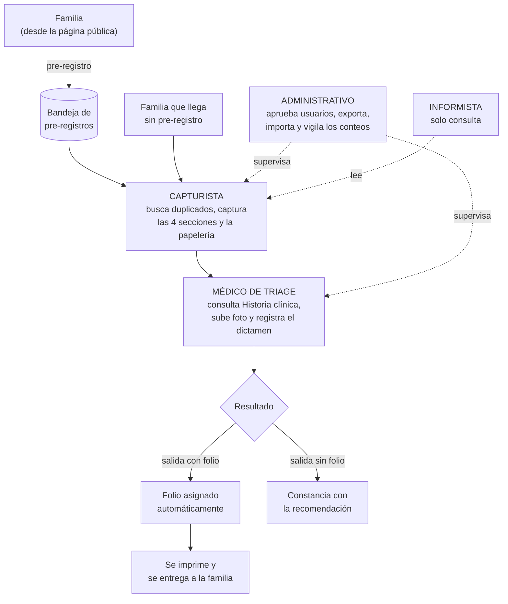
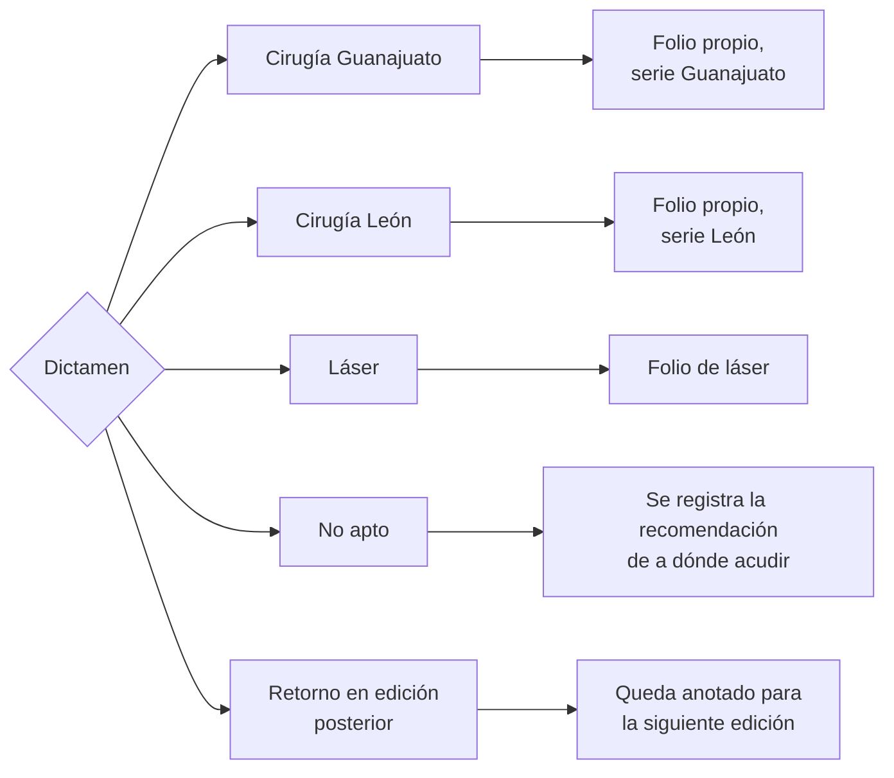
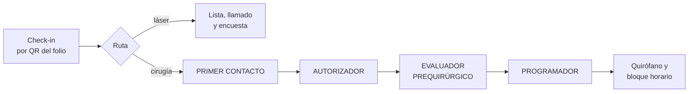

# Manual por rol

**Programa Nuevo Amanecer, A.C. — sistema de gestión de jornadas**
Versión 1.4 · 6 de agosto de 2026

Este documento responde una sola pregunta: **¿qué me toca a mí?**

Para el flujo del día, el plan de contingencia y las reglas de manejo de información, ver
[OPERACION.md](OPERACION.md) — aquí no se repiten.

> **Todo lo que dice este manual está comprobado contra la base de datos**, no deducido del
> código. Cada «sí puedes» y cada «no puedes» se ejecutó con la cuenta de ese rol. Si algo aquí
> no coincide con lo que ves en pantalla, avisa: el error es del manual.

---

## 1. Quién toca qué, y en qué orden

## 2. Qué alcanza cada rol

Comprobado con las cuentas de cada rol contra las políticas de la base.

| | Capturista | Médico de triage | Administrativo | Informista |
|---|:---:|:---:|:---:|:---:|
| Consultar expedientes y personas | ✅ | ✅ | ✅ | ✅ |
| Ver quién modificó qué y cuándo | ✅ | ✅ | ✅ | ✅ |
| Crear y editar personas | ✅ | ✅¹ | ✅ | ❌ |
| Capturar Historia clínica | ✅ | ✅¹ | ✅ | ❌ |
| Capturar Datos socioeconómicos | ✅ | ✅¹ | ✅ | ❌ |
| Validar y promover pre-registros | ✅ | ✅¹ | ✅ | ❌ |
| Subir papelería firmada | ✅ | ✅¹ | ✅ | ❌ |
| Subir la foto del paciente | ❌ | ✅ | ✅ | ❌ |
| Eliminar una foto del paciente ya subida | ❌ | ✅ | ✅ | ❌ |
| Registrar o corregir el dictamen | ❌ | ✅ | ✅ | ❌ |
| Imprimir folios y constancias | ✅ | ✅ | ✅ | ✅ |
| Exportar el padrón | ❌ | ❌ | ✅ | ❌ |
| Imprimir listas filtradas del tablero de conteos | ❌ | ❌ | ✅ | ❌ |
| Importar de contingencia | ❌ | ❌ | ✅ | ❌ |
| Aprobar usuarios, cambiarles el rol después e invitar directamente | ❌ | ❌ | ✅ | ❌ |
| Generar un enlace temporal para que alguien restablezca su contraseña | ❌ | ❌ | ✅ | ❌ |
| Crear jornadas y editar el catálogo | ❌ | ❌ | ✅ | ❌ |
| Ver quién se ofreció a colaborar | ❌ | ❌ | ✅ | ❌ |

> ¹ **Solo dentro de `/captura`** — por ejemplo, si ayudas con un expediente que normalmente
> llevaría un capturista. En `/dictamen` ves Historia clínica y Datos socioeconómicos, pero
> solo para **consultarlos**: aparecen colapsados y sin poder editarlos; esa pantalla se
> centra en la foto y el dictamen. Ver §4.

> **Una cuenta sin aprobar no ve absolutamente nada.** No es que se le oculten los botones: la
> base de datos le devuelve cero filas. Comprobado.

---

## 3. Capturista

**Qué haces.** Eres quien tiene a la familia enfrente. Registras al paciente y a su adulto
responsable, llenas las cuatro secciones del expediente, imprimes la papelería, la recoges
firmada y la subes. Cuando el expediente está completo, pasa al médico.

**Qué ves al entrar.** En `/pacientes`, el listado de expedientes de la jornada — la misma
lista que ven médico, administrativo e informista; a ti te corresponden los botones
**Captura** y **Vista** en cada fila. "Nuevo paciente", arriba, lleva al asistente de alta.

**Lo que sí puedes**

- Buscar personas y ver su historial de jornadas anteriores. **Un solo dato basta** — CURP,
  teléfono, fecha de nacimiento o nombre solos ya encuentran a alguien; no hace falta tener
  varios datos a la mano.
- Crear personas y expedientes, y editarlos cuantas veces haga falta.
- Abrir la bandeja de **pre-registros** y promover uno a expediente.
- Subir consentimientos y documentos, y volver a subirlos si una foto salió borrosa.
- Ver la foto del paciente una vez que el médico la suba (no la subes tú — ver §4).
- Imprimir el folio y la constancia.

**Lo que no puedes, y qué pasa si lo intentas**

- **Registrar o cambiar un dictamen.** Aunque llegaras a la pantalla, la base lo rechaza.
- **Exportar el padrón.** Es del administrativo, y cada exportación queda registrada con nombre.
- **Aprobar usuarios, crear jornadas o tocar el catálogo.**

**Errores frecuentes**

| Situación | Qué hacer |
|---|---|
| Creaste a alguien que ya existía | Avisa al administrativo. No se borra: se concilia después |
| No encuentras a alguien que juras que ya vino | Prueba con un solo dato a la vez (nombre, fecha de nacimiento, CURP o teléfono) — no hace falta darlos todos, y la búsqueda tolera errores de escritura en el nombre |
| La familia no trae adulto responsable | No se puede terminar el expediente. Cítala de nuevo con acompañante |
| Cerraste sin guardar | El expediente se guarda solo mientras escribes. Vuelve a abrirlo |

**El error que más caro sale: no buscar antes de crear.** La asociación lleva cuarenta años
atendiendo gente que regresa cada seis meses. Un duplicado hoy es un historial perdido en la
siguiente jornada. Ver [OPERACION.md](OPERACION.md) §2.

---

## 4. Médico de triage

**Qué haces.** Valoras a cada paciente y registras tu dictamen. Tu resolución es lo que decide
si la familia se va con un folio o con una constancia.

**Qué ves al entrar.** En `/pacientes`, la misma lista que ven capturista, administrativo e
informista — a ti te corresponden los botones **Dictaminar** y **Vista** en cada fila. No
hace falta que la captura esté terminada: el dictamen se puede registrar en cuanto el
paciente y su adulto responsable existen en el sistema, aunque Historia clínica o Datos
socioeconómicos sigan a medias.

**Lo que sí puedes**

- Consultar el expediente entero.
- **Consultar Historia clínica y Datos socioeconómicos**, en dos menús colapsables (cerrados
  por defecto, haz clic para abrirlos) antes del dictamen. Aquí son **solo lectura** — para
  editarlos entra al mismo expediente por `/captura` (ver el recuadro más abajo). Historia
  clínica puede venir organizada en subsecciones con nombre (Motivo de consulta, Antecedentes
  heredofamiliares, Exploración física general…), solo para ordenar la pantalla.
- **Tomar o subir la foto del paciente**, desde el celular en el momento de la valoración —
  un botón de cámara en el teléfono, uno de archivo en escritorio. Se organiza en tres vistas
  fijas (anterior, lateral derecha, lateral izquierda), hasta 3 fotos por vista. Haz clic en
  cualquier foto para verla más grande sin salir de la página; ahí mismo puedes **eliminarla**
  si subiste la equivocada (tú o un administrativo, nadie más) — no se borra de verdad, queda
  desactivada y con rastro en la auditoría, igual que el resto del sistema.
- Registrar el dictamen, eligiendo entre las salidas que un administrativo haya configurado
  para la jornada (`/admin` → Opciones de dictamen, sin desplegar código). En esta jornada
  son cinco:

- Corregir un dictamen que registraste mal. Queda constancia del cambio.

**Lo que no puedes en `/dictamen`, y qué pasa si lo intentas**

- **Editar los datos personales del paciente o del adulto responsable** (nombre, CURP, teléfono,
  domicilio…) desde esta pantalla. Si hay un error ahí, se lo dices al capturista — o lo corriges
  tú mismo entrando por `/captura` (ver el recuadro siguiente).
- **Editar Historia clínica o Datos socioeconómicos** desde `/dictamen`. Ambas se ven (colapsadas,
  de solo consulta) pero no se editan aquí — para eso entra al mismo expediente por `/captura`.
- **Exportar o administrar.**

> ℹ **Cuando entras por `/captura`, tienes las mismas facultades que un capturista.** Si ayudas
> con un expediente ahí —por ejemplo, para corregir el teléfono del responsable o completar
> Datos socioeconómicos— puedes editar personas, ambas secciones del catálogo, promover
> pre-registros y subir papelería firmada, exactamente igual que un capturista. Es la base de
> datos la que decide esto por tu rol, no la pantalla en la que estás parado: en `/dictamen`
> Historia clínica y Datos socioeconómicos se ven, pero no se editan — ahí tu trabajo es otro
> (consultar, subir la foto, dictaminar). No hay dos cuentas ni un cambio de rol — es la misma
> sesión, solo cambia lo que la pantalla te muestra.

**Sobre el folio.** No lo generas tú a mano: al guardar un dictamen «apto», el sistema lo asigna
en la misma operación. Si el dictamen se guardó, el folio existe. Nunca hay uno sin el otro.

**Errores frecuentes**

| Situación | Qué hacer |
|---|---|
| El expediente que buscas no aparece | Puede ser de otra jornada, o no estar creado — pide al capturista que verifique |
| El expediente todavía no tiene nada capturado | Puedes dictaminarlo de todas formas: el dictamen ya no espera a que termine la captura |
| Te equivocaste de resultado | Corrígelo. Queda registrado quién lo cambió y cuándo |
| Falta un estudio para decidir | Aplazar el caso es una salida válida, no un fracaso — usa la opción de retorno que tenga configurada la jornada |
| La foto salió mal | Haz clic en ella para ampliarla y elimínala ahí mismo, luego sube la correcta a esa misma vista (máx. 3 por vista) |

---

## 5. Administrativo

**Qué haces.** Sostienes la jornada por detrás: das de alta al personal, vigilas los números y
te llevas la información al cierre del día.

**Qué ves al entrar.** En `/admin`, los conteos del día: cuántos expedientes, cuántos
dictaminados, y un desglose por cada salida de dictamen configurada para la jornada (aptos
por cada tipo de cirugía, aptos para láser, no aptos…).

**Lo que sí puedes**

- **Todo lo del capturista**, además de lo tuyo.
- **Aprobar usuarios y asignar roles.** Nadie entra al sistema sin que tú lo apruebes.
- **Cambiarle el rol a alguien que ya está activo**, si cambió de función a media temporada —
  desde `/admin/usuarios`, no hace falta suspenderlo y volver a aprobarlo.
- **Generar un enlace temporal para que alguien restablezca su contraseña**, si la olvidó. El
  sistema te muestra el enlace para copiarlo y compartirlo como prefieras (WhatsApp, correo
  personal); no se envía solo, porque el proyecto no tiene correo propio configurado.
- **Invitar directamente a un colaborador** desde la bandeja de `/admin/colaboradores` —le
  asignas el rol ahí mismo y le compartes el enlace para que fije su propia contraseña la primera
  vez. No pasa por el registro público ni por la aprobación aparte: al invitarlo con un rol, ya
  lo estás aprobando.
- **Corregir un dictamen** cuando el médico ya no está disponible.
- **Exportar el padrón** a CSV, con los filtros que apliques.
- **Hacer clic en cualquier número del tablero de conteos** para ver la lista de personas detrás
  de esa cifra, e **imprimirla** con una vista mínima (nombre, fecha de nacimiento, estado o
  dictamen, folio) para no cargar más datos personales de los necesarios en el papel.
- **Importar** lo capturado en papel durante una contingencia.
- Crear jornadas, editar el catálogo de campos, **configurar las opciones de dictamen de la
  jornada** (qué salidas ve el médico y con qué etiqueta — `/admin/dictamen-opciones`, sin
  desplegar código) y revisar quién se ofreció a colaborar.

**Lo que no puedes**

- **Borrar.** Nada se borra en este sistema, ni tú. Las correcciones conservan el valor anterior.
  Es exigencia de la NOM-004, no una decisión de diseño.
- **Ocultar tu rastro.** Cada exportación —y cada impresión de una lista del tablero— queda
  anotada con tu nombre, la hora, los filtros que usaste y cuántas filas te llevaste.

**Tus dos responsabilidades más delicadas**

1. **Antes de la jornada:** que los cinco capturistas y el personal médico estén aprobados con su
   rol correcto. Alguien sin aprobar no ve nada, y a las ocho de la mañana no es momento de
   descubrirlo.
2. **Al cierre de cada día:** descargar el respaldo y sacarlo del equipo. Ver
   [OPERACION.md](OPERACION.md) §4.

---

## 6. Informista

**Qué haces.** Consultas y respondes. No modificas nada.

**Qué ves al entrar.**

> ⚠ **Léelo antes de tu primer turno.** El sistema te lleva a `/pacientes`, la misma lista que
> ven los demás roles — a ti solo te corresponde el botón **Vista** en cada fila, de puro
> consulta. Si entras a un expediente por `/captura` (por ejemplo siguiendo un enlace viejo),
> **Historia clínica y Datos socioeconómicos ya te avisan bien**: se ven con los campos
> apagados y una nota de «Solo lectura — tu rol no puede editar esta sección», así que ahí no
> hay sorpresa.
>
> **Lo que todavía no está corregido** en esa misma pantalla de `/captura`: los datos del
> paciente/responsable, la papelería y el botón «Nuevo expediente» **no** te avisan de la
> misma forma — se ven como si pudieras usarlos, pero la base rechaza el cambio igual. No está
> descompuesto ni es tu culpa: tu cuenta es de consulta. Mientras se termina de corregir:
> **si algo no responde, no insistas — no es para ti.**

**Lo que sí puedes**

- Buscar y consultar cualquier expediente, persona, folio y dictamen de la jornada.
- Ver el historial de jornadas anteriores de un paciente.
- Ver quién modificó cada cosa y cuándo.
- Imprimir folios y constancias.

**Lo que no puedes**

- Crear o editar cualquier cosa.
- Exportar, importar o administrar.

**Para qué sirve el rol.** Para responder en la mesa de informes sin poder alterar nada por
accidente. Es una protección para ti tanto como para el expediente.

---

## 7. Etapa 2 — roles que todavía no existen

> **Estas cuatro pantallas no están construidas.** Se entregan alrededor de la tercera semana de
> septiembre de 2026 (RF-220 a RF-246). Se describen aquí para poder planear y reclutar, pero
> **hoy no hay nada que usar**.

| Rol | De qué se hará cargo |
|---|---|
| **Primer contacto** | Residentes. Revisan la papelería que exige el hospital y marcan lo que falta. Preparan la carta de consentimiento informado, que va con dos testigos |
| **Autorizador** | Médico especialista. Resuelve si procede la cirugía, cuál y bajo qué condiciones. También puede reasignar a láser o posponer seis meses |
| **Evaluador prequirúrgico** | Registra si el paciente pasó la evaluación previa: sí o no |
| **Programador** | Define cuántos quirófanos hay y reparte a los pacientes por quirófano y horario, a lo largo de varios días |

Un caso solo llega al programador con **las tres aprobaciones**: papelería completa,
autorización del especialista y evaluación prequirúrgica superada.

---

## 8. Lo que aplica a todos

Extracto de [OPERACION.md](OPERACION.md) §5, que es donde está el detalle:

1. **Cada quien entra con su propia cuenta.** No se prestan credenciales. El sistema registra
   quién hizo cada cambio, y prestar la cuenta hace que ese registro mienta.
2. **No se comparten datos de pacientes** por WhatsApp personal, correo personal ni redes.
3. **No se toman fotos de las pantallas** con datos visibles.
4. **Las fotos de pacientes** solo se toman si el permiso de uso de imagen está firmado.
5. **Nada se borra.** Si algo está mal, se corrige; el valor anterior se conserva.

Son datos de salud de menores de edad. La ley los considera **sensibles**, y las consecuencias
de un mal manejo recaen sobre la asociación.

---

## 9. A quién acudir

| Tema | Con quién |
|---|---|
| No puedo entrar / mi cuenta no tiene rol | Administrativo de turno |
| Un botón no responde | Si eres informista, ver §6. Si no, avisa al responsable técnico |
| Duda sobre los datos de un paciente | Administrativo de turno |
| Duda sobre un dictamen | Médico responsable de la jornada |
| Se cayó el sistema | No esperes autorización: pasa a papel. [OPERACION.md](OPERACION.md) §3 |
| Una familia pide sus datos (derechos ARCO) | *Pendiente de definir por la asociación* |
