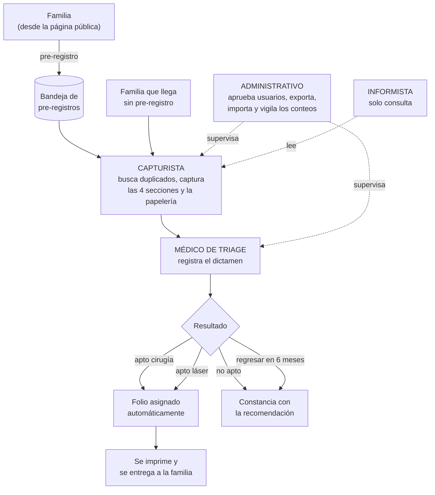
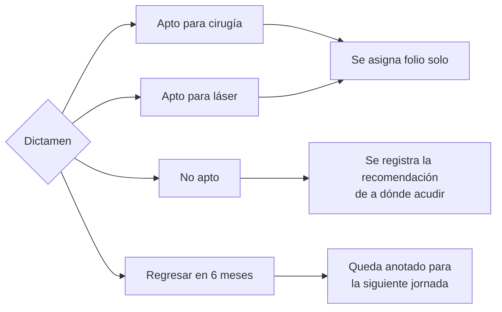
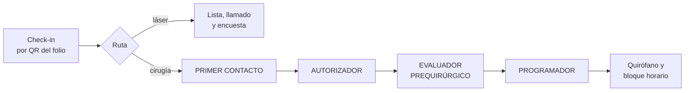

# Manual por rol

**Programa Nuevo Amanecer, A.C. — sistema de gestión de jornadas**
Versión 1.0 · 3 de agosto de 2026

Este documento responde una sola pregunta: **¿qué me toca a mí?**

Para el flujo del día, el plan de contingencia y las reglas de manejo de información, ver
[OPERACION.md](OPERACION.md) — aquí no se repiten.

> **Todo lo que dice este manual está comprobado contra la base de datos**, no deducido del
> código. Cada «sí puedes» y cada «no puedes» se ejecutó con la cuenta de ese rol. Si algo aquí
> no coincide con lo que ves en pantalla, avisa: el error es del manual.

---

## 1. Quién toca qué, y en qué orden

## 2. Qué alcanza cada rol

Comprobado con las cuentas de cada rol contra las políticas de la base.

| | Capturista | Médico de triage | Administrativo | Informista |
|---|:---:|:---:|:---:|:---:|
| Consultar expedientes y personas | ✅ | ✅ | ✅ | ✅ |
| Ver quién modificó qué y cuándo | ✅ | ✅ | ✅ | ✅ |
| Crear y editar personas | ✅ | ❌ | ✅ | ❌ |
| Capturar las secciones del expediente | ✅ | ❌ | ✅ | ❌ |
| Validar y promover pre-registros | ✅ | ❌ | ✅ | ❌ |
| Subir papelería firmada | ✅ | ❌ | ✅ | ❌ |
| Registrar o corregir el dictamen | ❌ | ✅ | ✅ | ❌ |
| Imprimir folios y constancias | ✅ | ✅ | ✅ | ✅ |
| Exportar el padrón | ❌ | ❌ | ✅ | ❌ |
| Importar de contingencia | ❌ | ❌ | ✅ | ❌ |
| Aprobar usuarios y asignar roles | ❌ | ❌ | ✅ | ❌ |
| Crear jornadas y editar el catálogo | ❌ | ❌ | ✅ | ❌ |
| Ver quién se ofreció a colaborar | ❌ | ❌ | ✅ | ❌ |

> **Una cuenta sin aprobar no ve absolutamente nada.** No es que se le oculten los botones: la
> base de datos le devuelve cero filas. Comprobado.

---

## 3. Capturista

**Qué haces.** Eres quien tiene a la familia enfrente. Registras al paciente y a su adulto
responsable, llenas las cuatro secciones del expediente, imprimes la papelería, la recoges
firmada y la subes. Cuando el expediente está completo, pasa al médico.

**Qué ves al entrar.** El listado de expedientes de la jornada, en `/captura`.

**Lo que sí puedes**

- Buscar personas y ver su historial de jornadas anteriores.
- Crear personas y expedientes, y editarlos cuantas veces haga falta.
- Abrir la bandeja de **pre-registros** y promover uno a expediente.
- Subir consentimientos y documentos, y volver a subirlos si una foto salió borrosa.
- Imprimir el folio y la constancia.

**Lo que no puedes, y qué pasa si lo intentas**

- **Registrar o cambiar un dictamen.** Aunque llegaras a la pantalla, la base lo rechaza.
- **Exportar el padrón.** Es del administrativo, y cada exportación queda registrada con nombre.
- **Aprobar usuarios, crear jornadas o tocar el catálogo.**

**Errores frecuentes**

| Situación | Qué hacer |
|---|---|
| Creaste a alguien que ya existía | Avisa al administrativo. No se borra: se concilia después |
| No encuentras a alguien que juras que ya vino | Busca por teléfono, o solo por apellido. La búsqueda tolera errores de escritura |
| La familia no trae adulto responsable | No se puede terminar el expediente. Cítala de nuevo con acompañante |
| Cerraste sin guardar | El expediente se guarda solo mientras escribes. Vuelve a abrirlo |

**El error que más caro sale: no buscar antes de crear.** La asociación lleva cuarenta años
atendiendo gente que regresa cada seis meses. Un duplicado hoy es un historial perdido en la
siguiente jornada. Ver [OPERACION.md](OPERACION.md) §2.

---

## 4. Médico de triage

**Qué haces.** Valoras a cada paciente y registras tu dictamen. Tu resolución es lo que decide
si la familia se va con un folio o con una constancia.

**Qué ves al entrar.** En `/dictamen`, la lista de expedientes **completos** que esperan
valoración. Un expediente a medio capturar no te aparece: falta información para decidir.

**Lo que sí puedes**

- Consultar el expediente entero, incluidos antecedentes y estudio socioeconómico.
- Registrar el dictamen, con cuatro salidas posibles:

- Corregir un dictamen que registraste mal. Queda constancia del cambio.

**Lo que no puedes, y qué pasa si lo intentas**

- **Editar los datos del paciente o las secciones del expediente.** Si hay un error, se lo dices
  al capturista. La base rechaza la edición.
- **Exportar o administrar.**

**Sobre el folio.** No lo generas tú a mano: al guardar un dictamen «apto», el sistema lo asigna
en la misma operación. Si el dictamen se guardó, el folio existe. Nunca hay uno sin el otro.

**Errores frecuentes**

| Situación | Qué hacer |
|---|---|
| El expediente no aparece en tu lista | Está incompleto. El capturista debe terminarlo |
| Te equivocaste de resultado | Corrígelo. Queda registrado quién lo cambió y cuándo |
| Falta un estudio para decidir | Regresar en 6 meses es una salida válida, no un fracaso |

---

## 5. Administrativo

**Qué haces.** Sostienes la jornada por detrás: das de alta al personal, vigilas los números y
te llevas la información al cierre del día.

**Qué ves al entrar.** En `/admin`, los conteos del día: cuántos expedientes, cuántos
dictaminados, cuántos aptos para cirugía y para láser, cuántos no aptos.

**Lo que sí puedes**

- **Todo lo del capturista**, además de lo tuyo.
- **Aprobar usuarios y asignar roles.** Nadie entra al sistema sin que tú lo apruebes.
- **Corregir un dictamen** cuando el médico ya no está disponible.
- **Exportar el padrón** a CSV, con los filtros que apliques.
- **Importar** lo capturado en papel durante una contingencia.
- Crear jornadas, editar el catálogo de campos y revisar quién se ofreció a colaborar.

**Lo que no puedes**

- **Borrar.** Nada se borra en este sistema, ni tú. Las correcciones conservan el valor anterior.
  Es exigencia de la NOM-004, no una decisión de diseño.
- **Ocultar tu rastro.** Cada exportación queda anotada con tu nombre, la hora, los filtros que
  usaste y cuántas filas te llevaste.

**Tus dos responsabilidades más delicadas**

1. **Antes de la jornada:** que los cinco capturistas y el personal médico estén aprobados con su
   rol correcto. Alguien sin aprobar no ve nada, y a las ocho de la mañana no es momento de
   descubrirlo.
2. **Al cierre de cada día:** descargar el respaldo y sacarlo del equipo. Ver
   [OPERACION.md](OPERACION.md) §4.

---

## 6. Informista

**Qué haces.** Consultas y respondes. No modificas nada.

**Qué ves al entrar.**

> ⚠ **Léelo antes de tu primer turno.** El sistema te lleva a la pantalla de captura, que tiene
> botones de «Nuevo expediente» y de guardar. **Esos botones no van a funcionar contigo.** No
> está descompuesto ni es tu culpa: tu cuenta es de consulta y la base rechaza cualquier cambio.
>
> Es un defecto de la pantalla, que debería ocultarte lo que no puedes usar. Está anotado para
> corregirse. Mientras tanto: **si algo no responde, no insistas — no es para ti.**

**Lo que sí puedes**

- Buscar y consultar cualquier expediente, persona, folio y dictamen de la jornada.
- Ver el historial de jornadas anteriores de un paciente.
- Ver quién modificó cada cosa y cuándo.
- Imprimir folios y constancias.

**Lo que no puedes**

- Crear o editar cualquier cosa.
- Exportar, importar o administrar.

**Para qué sirve el rol.** Para responder en la mesa de informes sin poder alterar nada por
accidente. Es una protección para ti tanto como para el expediente.

---

## 7. Etapa 2 — roles que todavía no existen

> **Estas cuatro pantallas no están construidas.** Se entregan alrededor de la tercera semana de
> septiembre de 2026 (RF-220 a RF-246). Se describen aquí para poder planear y reclutar, pero
> **hoy no hay nada que usar**.

| Rol | De qué se hará cargo |
|---|---|
| **Primer contacto** | Residentes. Revisan la papelería que exige el hospital y marcan lo que falta. Preparan la carta de consentimiento informado, que va con dos testigos |
| **Autorizador** | Médico especialista. Resuelve si procede la cirugía, cuál y bajo qué condiciones. También puede reasignar a láser o posponer seis meses |
| **Evaluador prequirúrgico** | Registra si el paciente pasó la evaluación previa: sí o no |
| **Programador** | Define cuántos quirófanos hay y reparte a los pacientes por quirófano y horario, a lo largo de varios días |

Un caso solo llega al programador con **las tres aprobaciones**: papelería completa,
autorización del especialista y evaluación prequirúrgica superada.

---

## 8. Lo que aplica a todos

Extracto de [OPERACION.md](OPERACION.md) §5, que es donde está el detalle:

1. **Cada quien entra con su propia cuenta.** No se prestan credenciales. El sistema registra
   quién hizo cada cambio, y prestar la cuenta hace que ese registro mienta.
2. **No se comparten datos de pacientes** por WhatsApp personal, correo personal ni redes.
3. **No se toman fotos de las pantallas** con datos visibles.
4. **Las fotos de pacientes** solo se toman si el permiso de uso de imagen está firmado.
5. **Nada se borra.** Si algo está mal, se corrige; el valor anterior se conserva.

Son datos de salud de menores de edad. La ley los considera **sensibles**, y las consecuencias
de un mal manejo recaen sobre la asociación.

---

## 9. A quién acudir

| Tema | Con quién |
|---|---|
| No puedo entrar / mi cuenta no tiene rol | Administrativo de turno |
| Un botón no responde | Si eres informista, ver §6. Si no, avisa al responsable técnico |
| Duda sobre los datos de un paciente | Administrativo de turno |
| Duda sobre un dictamen | Médico responsable de la jornada |
| Se cayó el sistema | No esperes autorización: pasa a papel. [OPERACION.md](OPERACION.md) §3 |
| Una familia pide sus datos (derechos ARCO) | *Pendiente de definir por la asociación* |
