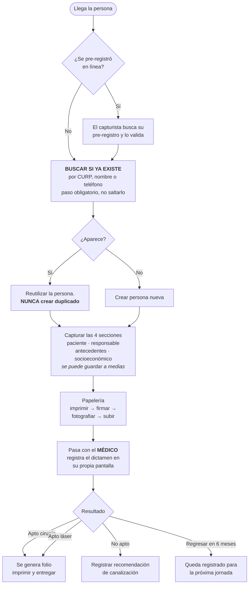

# Guía de operación

**Jornada Guanajuato · 3 al 7 de agosto de 2026**
Versión 1.0 · 27 de julio de 2026

Documento dirigido al **personal que opera la jornada**, no al equipo técnico.

---

## 1. Antes de la jornada

### Lista de verificación — cierre del 2 de agosto

- [ ] Los **5 capturistas** tienen cuenta creada y **aprobada** con su rol asignado.
- [ ] El o los **médicos de triage** tienen cuenta aprobada con rol `medico_triage`.
- [ ] El **catálogo de campos** está cargado y validado por la asociación.
- [ ] Se hizo el **ensayo general** completo y se cronometró la captura.
- [ ] Las impresoras están **probadas** con folios de prueba, y los QR se escanean bien.
- [ ] Están impresos los **formatos en papel** de contingencia para toda la semana.
- [ ] Está impreso el **talonario de folios de respaldo**.
- [ ] Los cuatro documentos legales están **revisados por el abogado** e impresos.
- [ ] El **respaldo automático** está verificado (no basta con que esté configurado).

> **Regla:** si algo de esta lista no está listo el 2 de agosto, se opera esa parte en papel.
> No se improvisa durante el evento.

---

## 2. Flujo del día — Etapa 1



### El paso que más importa

**Buscar antes de crear.** La asociación lleva ~40 años atendiendo a personas que regresan cada
seis meses. Si se crean duplicados, en la siguiente jornada nadie podrá saber qué se dictaminó
antes. El sistema obliga a revisar coincidencias, pero **la decisión es del capturista**: ante
la duda, preguntar a la familia si ya habían venido antes.

### Al entregar el folio

Explicar a la familia, en voz alta:

1. **Este folio es su lugar.** Sin él no pueden pasar a la segunda revisión.
2. **Traerlo el día de la cita**, junto con la documentación pendiente.
3. La cita de la segunda revisión es **el día y la sede impresos en el folio**.
4. Si lo pierden, se puede reponer con su nombre y CURP — pero es mejor no perderlo.

---

## 3. Plan de contingencia

### Cuándo activarlo

Actívalo si ocurre cualquiera de estas cosas, **sin esperar a que alguien lo autorice**:

- El sistema no carga o va tan lento que se forma fila.
- Se cae el internet en la sede.
- Se cae la luz y las laptops se agotan.

**No se detiene la atención de las familias por un problema técnico.**

### Qué hacer

1. **Cambiar a papel.** Los formatos impresos son idénticos al formulario digital. Se llenan
   igual, en el mismo orden.
2. **Usar el talonario de folios de respaldo.** Anotar en el formato de papel el folio
   pre-impreso que se entregó.
3. **Mantener el orden.** Los formatos llenos van en una sola charola, en orden de llegada.
   Nadie se los lleva a su lugar.
4. **Avisar al responsable técnico**, pero sin dejar de atender.

### Después

Cuando el sistema vuelva, un capturista designado transcribe los formatos de papel. **No se
transcribe a mitad de la jornada** — se hace al cierre del día o al día siguiente, con calma.
Los folios de respaldo ya entregados se registran tal cual se dieron, sin reasignarlos.

---

## 4. Cierre de cada día

- [ ] Revisar que ningún expediente quede en estado `borrador` sin razón.
- [ ] Transcribir los formatos de papel del día, si los hubo.
- [ ] Verificar que la papelería firmada esté subida y legible.
- [ ] **Descargar el respaldo manual** y guardarlo fuera del equipo de trabajo.
- [ ] Anotar los conteos del día (los da el panel administrativo, en la portada).

### Respaldos (RF-194)

Hay **dos** respaldos y no son lo mismo:

| | Quién lo hace | Cada cuándo | Dónde se ve |
|---|---|---|---|
| **Automático** | Supabase, plan Pro | Diario | Panel de Supabase → *Database* → *Backups* |
| **Manual** | Nosotros, al cierre | Cada día de jornada | `privado/respaldos/` |

> **Verificar el automático antes de la jornada.** Si el proyecto está en plan gratuito **no
> hay respaldo automático**. Entrar al panel y confirmar que aparecen respaldos recientes; si
> no, el manual es el único que existe.
>
> **Este proyecto, hoy, está en plan gratuito.** No es un caso hipotético: hasta que se
> contrate Supabase Pro (~$25 USD/mes, ya presupuestado en `docs/PLAN.md`), **todo respaldo es
> manual**. No dar por hecho el automático solo porque en algún momento se contrate el plan de
> pago — verificarlo en el panel cada vez.

### La pausa por inactividad (plan gratuito)

Consecuencia distinta a la de los respaldos, y también propia del plan gratuito: Supabase
**pausa el proyecto completo tras ~7 días sin actividad**. Esta app se usa en ráfagas —dos
jornadas al año—, así que sin mitigación el sistema podría estar dormido justo el día que una
familia intenta pre-registrarse desde la landing.

Mitigación ya instalada: una función en `/api/keepalive` (`app/api/keepalive/route.ts`) que
Vercel llama una vez al día (`vercel.json`, gratis en el plan Hobby) y hace una lectura trivial
a la base. Esto **evita la pausa**, pero no sustituye nada de lo anterior: sigue sin haber
respaldo automático, y si Vercel Cron fallara un día, no hay alerta — conviene revisar de vez en
cuando en el panel de Vercel (*Deployments → Cron Jobs*) que sigue corriendo.

**Respaldo manual:**

```powershell
.\scripts\respaldo.ps1 -CadenaConexion "postgresql://..."   # produccion
.\scripts\respaldo.ps1 -Local                                # base de desarrollo
```

Genera **dos** archivos con fecha, y hacen falta los dos: `…-esquema.sql` y `…-datos.sql`.
El script se detiene solo si alguno sale vacío. Copiarlos fuera del equipo el mismo día:
un respaldo que vive únicamente en la laptop de la jornada no protege del robo de la laptop.

**Cómo se restaura.** Probado el 3 de agosto de 2026 sobre la base local:

1. El destino tiene que ser un **proyecto de Supabase**, no una base PostgreSQL vacía. Los
   volcados dan por hechos los esquemas que crea Supabase (`auth`, `storage`, `extensions`,
   `vault`); con `psql` sobre una base limpia el esquema falla.
2. Aplicar el esquema desde las migraciones del repositorio, que son la fuente autorizada:
   `npx supabase db push`. El archivo `…-esquema.sql` es solo respaldo de esa referencia.
3. Cargar los datos:
   `psql <cadena-de-conexion> -f <fecha>-datos.sql`
4. Comprobar que quedó bien —no basta con que no truene—:

   ```sql
   select count(*) from public.persona;
   select count(*) from public.expediente;
   select nombre, rol, estado from public.usuario_perfil;
   ```

   Los conteos deben coincidir con los del día del respaldo, y **los roles deben conservarse**.
   Si el personal aparece como `pendiente` y sin rol, la restauración salió mal y nadie va a
   poder entrar al sistema.

> Los archivos de la papelería (fotos de consentimientos) viven en Supabase Storage y **no**
> entran en estos volcados. Se respaldan aparte desde el panel de Supabase.

---

## 5. Manejo de información de las familias

Estas reglas aplican a **todo el personal**, no solo a quien captura:

1. **No se comparten datos de pacientes** por WhatsApp personal, correo personal ni redes.
2. **No se toman fotos de las pantallas** con datos visibles.
3. **No se exportan listas** a dispositivos personales. Las exportaciones las hace el
   administrativo y se guardan donde la asociación indique.
4. **Las fotos de los pacientes** solo se toman si el permiso de uso de imagen está firmado.
5. Cada quien entra **con su propia cuenta**. No se prestan credenciales — el sistema registra
   quién hizo cada cambio, y prestar la cuenta hace que ese registro mienta.

Son datos de salud de menores de edad. La ley los clasifica como **sensibles** y las
consecuencias de un mal manejo recaen sobre la asociación.

---

## 6. Problemas frecuentes

| Situación | Qué hacer |
|---|---|
| La persona no tiene CURP | Capturar sin CURP. El sistema identifica por nombre, fecha de nacimiento y sexo. |
| La persona no trae adulto responsable | No se puede completar el expediente. Citarla de nuevo con un acompañante. Aplica aunque sea mayor de edad. |
| El paciente ya vino en jornadas anteriores | Reutilizar la persona existente. El sistema muestra su historial. |
| Un hermano ya está capturado con el mismo responsable | Reutilizar al responsable, no volver a capturarlo. |
| Falta documentación | Capturar lo que haya y marcar lo pendiente. Se completa en la segunda revisión. |
| El QR no escanea | Teclear el folio a mano. Tiene dígito verificador y avisa si hay error de tecleo. |
| Se imprimió mal el folio | Reimprimir. El folio no cambia, es el mismo. |
| El médico se equivocó de dictamen | Un administrativo puede corregirlo. Queda registrado quién lo cambió y cuándo. |

---

## 7. A quién acudir

| Tema | Contacto |
|---|---|
| Problema técnico durante el evento | *Por definir* |
| Dudas sobre datos de un paciente | Administrativo de turno |
| Dudas sobre el dictamen | Médico responsable de la jornada |
| Solicitud de una familia sobre sus datos (derechos ARCO) | *Por definir — pendiente de la asociación* |
